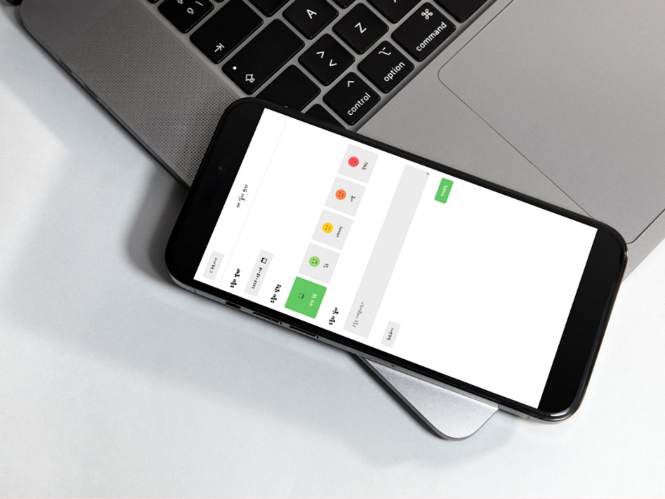

## Feelings Diary

A simple, responsive diary web app to record daily feelings and notes. Built with React and Vite, persisting data in LocalStorage.

### Screenshots / UI Preview



### 주요 기능

| 기능                 | 설명                                                   |
| -------------------- | ------------------------------------------------------ |
| **일기 작성**        | 날짜, 감정 상태, 일기 내용 입력, 새로운 일기 작성      |
| **감정 선택**        | 5단계 감정 스케일 선택, 현재 감정 시각적 표현          |
| **일기 목록 조회**   | 월별 일기 목록 조회, 월 이동 기능, 과거/미래 일기 확인 |
| **일기 상세 보기**   | 작성 일기 상세 내용 확인, 감정 이미지와 함께 표시      |
| **일기 수정**        | 기존 일기 내용, 날짜, 감정 수정                        |
| **일기 삭제**        | 불필요한 일기 삭제, 삭제 확인 메시지 제공              |
| **데이터 영속성**    | 로컬 스토리지 활용, 데이터 유지                        |
| **반응형 디자인**    | 다양한 화면 크기 대응, 반응형 웹 디자인 적용           |
| **페이지 제목 관리** | 현재 페이지 동적 제목 설정                             |

### Tech Stack

- React 18 + Vite
- React Router
- CSS (responsive design)
- ESLint

### Getting Started

Prerequisites:

- Node.js 18+

Install and run:

```bash
npm install
npm run dev
```

Build and preview:

```bash
npm run build
npm run preview
```

### Project Structure

- `src/pages`: route pages like `Home`, `New`, `Edit`, `Diary`
- `src/components`: reusable UI elements (e.g., `Editor`, `Viewer`, `DiaryList`)
- `src/hooks`: custom hooks (`useDiary`, `usePageTitle`)
- `src/util`: helpers and constants

### Data Persistence

LocalStorage is used to store diary entries on the client device. Clearing browser storage will remove saved entries.

